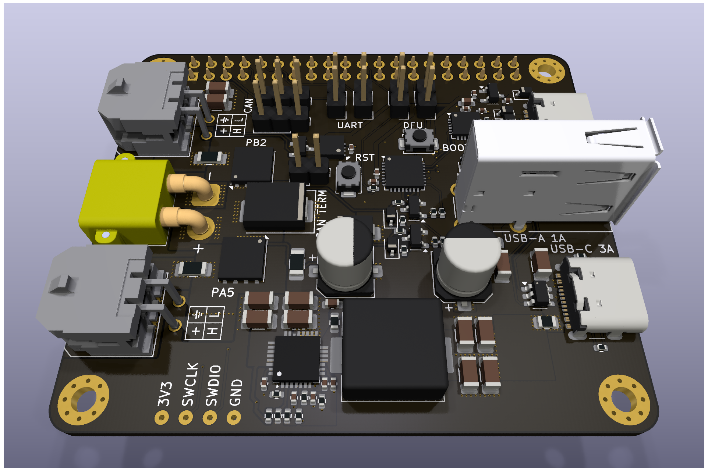

# 🔌 Universal Voron Power & CAN HAT (EWS)

> 🌍 **Sprachen:** [English](README.md) | [Deutsch](README.de.md)

Ein universelles Interface-Board (HAT) für Raspberry Pi 4/5 und Radxa Rock 5B zur Verwendung in Voron 3D-Druckern. Bietet eine leistungsstarke 5V-Versorgung (8A), CAN-Bus-Interface (USB-Bridge oder Native), USB-Hub und Lüftersteuerung.



## 📚 Inhalt

<!-- @import "[TOC]" {cmd="toc" depthFrom=1 depthTo=6 orderedList=false} -->

<!-- code_chunk_output -->

- [🔌 Universal Voron Power & CAN HAT (EWS)](#-universal-voron-power--can-hat-ews)
  - [📚 Inhalt](#-inhalt)
  - [🎯 Über EWS](#-über-ews)
  - [✨ Features](#-features)
    - [🔋 Stromversorgung (24V Eingang)](#-stromversorgung-24v-eingang)
    - [⚡ DC/DC Wandler (5V Ausgang)](#-dcdc-wandler-5v-ausgang)
    - [🔌 Logik-Spannungsversorgung (Power Path)](#-logik-spannungsversorgung-power-path)
    - [🧠 MCU & CAN Interface](#-mcu--can-interface)
    - [📡 USB Hub](#-usb-hub)
    - [🌊 Lüftersteuerung](#-lüftersteuerung)
  - [📋 Klipper Konfiguration](#-klipper-konfiguration)
    - [Basis MCU Setup](#basis-mcu-setup)
    - [Lüftersteuerung](#lüftersteuerung)
  - [🔌 Pinout & Steckerbelegung](#-pinout--steckerbelegung)
    - [Stromeingang](#stromeingang)
    - [CAN-Bus Anschlüsse](#can-bus-anschlüsse)
    - [USB Anschlüsse](#usb-anschlüsse)
    - [Lüftersteuerung](#lüftersteuerung-1)
  - [🛠️ PCB Spezifikationen](#️-pcb-spezifikationen)
  - [⚠️ Fertigungsempfehlungen](#️-fertigungsempfehlungen)
    - [PCB-Fertigung](#pcb-fertigung)
    - [Bestückungshinweise](#bestückungshinweise)
    - [Bauteilbeschaffung](#bauteilbeschaffung)
  - [🛠️ Technische Spezifikationen](#️-technische-spezifikationen)
  - [📚 Weitere Ressourcen](#-weitere-ressourcen)
  - [Lizenz](#lizenz)

<!-- /code_chunk_output -->

## 🎯 Über EWS

**EWS** steht für "Eierlegende Wollmilchsau" - ein humorvoller Begriff für eine Universallösung, die alles kann. Dieses HAT wird seinem Spitznamen gerecht, indem es mehrere essentielle Funktionen für Voron 3D-Drucker-Steuerungssysteme in einem einzigen, kompakten Board vereint.

Das Board adressiert häufige Problemstellen in Voron-Builds durch robuste Stromverteilung, zuverlässige CAN-Kommunikation und praktische USB-Konnektivität bei gleichzeitiger Kompatibilität mit Raspberry Pi und Radxa Rock 5B Single-Board-Computern.

## ✨ Features

### 🔋 Stromversorgung (24V Eingang)

- **Eingangsspannung:** 24V DC nominal
- **Anschlüsse:** XT30PW-F (liegend) oder 5.08mm Schraubklemme
- **Verpolschutz:** P-Channel MOSFET (CJAC70P06, -60V, -70A, RDSon ca. 8mOhm)
- **Gate-Schutz MOSFET:** 15V Zener-Diode (BZT52C15S) zwischen Source und Gate
- **Spannungsteiler:** 30kOhm (Gate-Source) und 30kOhm (Gate-GND)
- **Überspannungsschutz:** TVS-Diode (SMAJ26A, 26V Standoff, Unidirektional) platziert NACH dem MOSFET gegen GND
- **Eingangssicherung:** Verteilte Absicherung (5A für DC/DC, je 5A für CAN-Anschlüsse)

### ⚡ DC/DC Wandler (5V Ausgang)

- **Controller:** MaxLinear XR76208 (Synchroner Step-Down, 8A, COT)
- **Eingangssicherung:** 5A SMD 1812 Slow Blow
- **Ausgangsspannung:** 5.25V (eingestellt über Feedback-Teiler: R_Top=15.5kOhm, R_Bottom=2.0kOhm)
- **Schaltfrequenz:** ca. 600kHz (eingestellt über Ron=30kOhm)
- **Induktivität:** 3.3µH Shielded (Sunlord MDA1050-3R3M, Isat ca. 17A)
- **Eingangskondensatoren:** 4x 10µF 1206 Keramik + 1x 100µF Elektrolyt/Polymer (Bulk)
- **Ausgangskondensatoren:** 4x 22µF 1206 Keramik
- **Stabilität:** Feed-Forward Kondensator (Cff) 1nF parallel zum oberen Feedback-Widerstand
- **Soft-Start:** 100nF an Pin SS (ca. 6ms Anlaufzeit)
- **Stromlimit:** 5.6kOhm Widerstand am ILIM Pin
- **Enable:** Spannungsteiler von 24V (100kOhm oben, 22kOhm unten) = ca. 4.3V am Pin

### 🔌 Logik-Spannungsversorgung (Power Path)

- **Konzept:** Trennung in +5V_PWR (Hochstrom für Screen/Webcam) und +5V_LOGIC (für MCU/Hub)
- **Dioden-Weiche (ORing):** 2x Schottky-Dioden (1N5819WS, 1A)
  - Quelle 1: USB_VBUS (vom Pi/PC) → Diode → +5V_LOGIC
  - Quelle 2: +5V_BUCK (vom 8A Regler) → Diode → +5V_LOGIC
- **Zweck:** Board ist per USB flashbar ohne 24V-Versorgung, kein Rückstrom in den PC
- **3.3V Erzeugung:** LDO (XC6206) gespeist aus +5V_LOGIC

### 🧠 MCU & CAN Interface

- **Mikrocontroller:** STM32G0B1KBU6 (UFQFPN-32)
- **Taktung:** Crystal-less (Interner HSI48 mit Clock Recovery System CRS über USB)
- **Pi-Verbindung:**
  - USB (PA11/PA12) an USB-Hub
  - UART (PA9/PA10) an Pi-Header (Pin 8/10) über Jumper trennbar
  - NRST an Pi GPIO 22 (via 1kOhm) + Taster gegen GND + 100nF Cap
  - BOOT0 (Pin 24/PA14 shared mit SWCLK) an Pi GPIO 27 (via 1kOhm) + Taster gegen 3.3V + 10kOhm Pull-Down
- **CAN-Transceiver:** MCP2542WFD (oder kompatibel)
- **Muxing:** Jumper wählbar zwischen STM32 (USB-CAN Bridge) und Rock/Pi Native GPIOs (Pin 3/5)
- **Terminierung:** 120 Ohm Widerstand, zuschaltbar per DIP-Switch (direkt an den Buchsen)
- **CAN-Anschlüsse:** 2x Molex Micro-Fit 3.0 (2x2)
- **Micro-Fit Pinout:** Pin 1=24V, Pin 2=GND (Obere Reihe), Pin 3=CAN_H, Pin 4=CAN_L (Untere Reihe)
- **CAN-Stromabsicherung:** Je 5A SMD 1812 Slow Blow pro Port

### 📡 USB Hub

- **Controller:** WCH CH334F (QFN-24)
- **Geschwindigkeit:** USB 2.0 High Speed (480 Mbit/s) mit MTT
- **Taktung:** Intern (Crystal-less), XI/XO Pins offen gelassen
- **Versorgung:** V5 an +5V_LOGIC
- **Upstream:** Zum Raspberry Pi Header (USB Loopback Kabel erforderlich) oder USB-C Input
- **Downstream Ports:**
  - STM32 (Intern)
  - USB-C Buchse (für Touchscreen)
  - USB-A Buchse (Vertikal, für Webcam)
  - JST-XH Header (Intern, Belegung: 5V, D-, D+, GND)

**USB Port Absicherung:**
- **Konzept:** 100µF Elko als Tank an +5V_PWR, gefolgt von Polyfuse, gefolgt von 22µF Keramik an der Buchse
- **USB-C Port (Screen):**
  - Polyfuse: 4.0A Hold Current (Derating für Hot Chamber berücksichtigt)
  - CC-Leitungen: CC1 und CC2 jeweils mit eigenem 10kOhm Widerstand an VBUS (hinter der Sicherung) gezogen (Source 3A Advertisement)
  - ESD-Schutz: SRV05-4 TVS-Array
- **USB-A Port (Webcam):**
  - Polyfuse: 1.5A Hold Current
  - ESD-Schutz: SRV05-4 TVS-Array

### 🌊 Lüftersteuerung

- **Anschluss:** Dual-Footprint JST-XH (2.54mm) und JST-PH 2-Pin parallel
- **Treiber:** N-Channel MOSFET (AO3400)
- **STM32 Pin:** PA8 (Timer 1, Hardware PWM fähig)
- **Fail-Safe:** 10kOhm Pull-Up Widerstand vom Gate nach 3.3V (Lüfter läuft 100% bei Reset/Flash-Vorgang)
- **Gate-Serienwiderstand:** 1kOhm

## 📋 Klipper Konfiguration

### Basis MCU Setup
```ini
[mcu hat]
canbus_uuid: your_uuid_here
# Alternative für USB-Verbindung:
# serial: /dev/serial/by-id/usb-katapult_stm32g0b1xx_your_id-if00

[temperature_sensor hat_mcu]
sensor_type: temperature_mcu
sensor_mcu: hat
```

### Lüftersteuerung
```ini
[temperature_fan mcu_fan]
pin: hat:!PA8
# Hinweis: Invertiert wegen Fail-Safe Pull-Up Logic
sensor_type: temperature_mcu
sensor_mcu: hat
max_power: 1.0
shutdown_speed: 1.0
cycle_time: 0.01
hardware_pwm: True
target_temp: 50.0
min_temp: 10
max_temp: 80
control: pid
pid_kp: 1.0
pid_ki: 0.5
pid_kd: 2.0
```

## 🔌 Pinout & Steckerbelegung

### Stromeingang
- **XT30PW-F (liegend)** oder **5.08mm Schraubklemme**
  - Pin 1: +24V
  - Pin 2: GND

### CAN-Bus Anschlüsse
- **2x Molex Micro-Fit 3.0 (2x2, THT)**
  - Pin 1: +24V (obere Reihe, links)
  - Pin 2: GND (obere Reihe, rechts)
  - Pin 3: CAN_H (untere Reihe, links)
  - Pin 4: CAN_L (untere Reihe, rechts)

### USB Anschlüsse
- **USB-C:** Touchscreen-Verbindung (5V/3A Fähigkeit)
- **USB-A:** Webcam-Verbindung (vertikale Montage)
- **JST-XH Intern:** 5V, D-, D+, GND

### Lüftersteuerung
- **JST-XH/PH 2-pin:** PWM Lüftersteuerung (5V Schaltung)

## 🛠️ PCB Spezifikationen

| Parameter | Spezifikation |
|-----------|---------------|
| **Formfaktor** | Standard HAT (65mm x 56mm) |
| **Lagenaufbau** | 4-Layer Multilayer |
| **Layer 1 (Top)** | Signal/Power |
| **Layer 2** | GND Plane |
| **Layer 3** | 5V Power Plane |
| **Layer 4 (Bottom)** | Signal/GND |
| **Lötstopplack** | Schwarz Matt |
| **Oberfläche** | ENIG (Gold) |
| **Silkscreen** | Weiß |
| **Montage** | Innere Montagelöcher (Pi/Rock kompatibel) |
| **EMV-Design** | Montagelöcher via Stitching-Vias mit GND-Planes verbunden (Layer 2 & Bottom), isoliert von 5V-Plane (Layer 3) |

## ⚠️ Fertigungsempfehlungen

### PCB-Fertigung
- **Kupferdicke:** **2oz Kupfer empfohlen** für verbesserte thermische Leistung und Strombelastbarkeit
- **Via-Spezifikationen:** Minimum 12-20 Vias am DC/DC-Ausgang für Thermal Management
- **Impedanzkontrolle:** 90 Ohm Differentiell für USB-Leiterbahnen (D+/D- Paare)

### Bestückungshinweise
- **24V Pfad:** Minimum 3mm Leiterbahnbreite auf Top & Bottom Layern für 12A Gesamtstrom
- **5V Verteilung:** Nutzung der Layer 3 Plane mit massiven Anbindungen (keine Thermals) an Header und Kondensatoren
- **Thermal Management:** QFN GND-Pads mit Vias angebunden, Bottom Layer Routing berücksichtigt

### Bauteilbeschaffung
- Polyfuse-Derating für Kammertemperaturen bis 60°C berücksichtigen
- Induktivitäten mit ausreichendem Sättigungsstrom wählen (>15A empfohlen)
- Low-ESR Kondensatoren für Schaltregler verwenden

## 🛠️ Technische Spezifikationen

| Parameter | Wert | Einheit |
|-----------|------|---------|
| **Eingangsspannung** | 24 ± 2 | V |
| **5V Ausgangsstrom** | 8 | A |
| **Logik-Versorgungsstrom** | 2 | A |
| **CAN-Baudrate** | bis zu 1 | Mbit/s |
| **USB-Geschwindigkeit** | 480 | Mbit/s |
| **Lüftersteuerung** | PWM, 5V Schaltung | - |
| **Betriebstemperatur** | -10 bis +70 | °C |
| **Abmessungen** | 65 x 56 | mm |

## 📚 Weitere Ressourcen

- [Klipper Dokumentation](https://www.klipper3d.org/Config_Reference.html)
- [CAN-Bus Setup Guide](https://www.klipper3d.org/CANBUS.html)
- [Voron Documentation](https://docs.vorondesign.com/)
- [STM32G0 Reference Manual](https://www.st.com/resource/en/reference_manual/rm0454-stm32g0x0-advanced-armbased-32bit-mcus-stmicroelectronics.pdf)
- [Katapult Firmware Flasher](https://github.com/Arksine/katapult)

## Lizenz

Dieses Projekt steht unter der **Creative Commons Namensnennung-Nicht kommerziell-Share Alike 4.0 International Lizenz** (CC BY-NC-SA 4.0).

[](https://creativecommons.org/licenses/by-nc-sa/4.0/deed.de)

Dies bedeutet, Sie dürfen:
- **Teilen** — das Material in jedwedem Format oder Medium vervielfältigen und weiterverbreiten
- **Bearbeiten** — das Material remixen, verändern und darauf aufbauen

Unter folgenden Bedingungen:
- **Namensnennung** — Sie müssen angemessene Urheber- und Rechteangaben machen, einen Link zur Lizenz beifügen und angeben, ob Änderungen vorgenommen wurden
- **Nicht kommerziell** — Sie dürfen das Material nicht für kommerzielle Zwecke nutzen
- **Weitergabe unter gleichen Bedingungen** — Wenn Sie das Material remixen, verändern oder anderweitig direkt darauf aufbauen, dürfen Sie Ihre Beiträge nur unter derselben Lizenz wie das Original verbreiten

Den vollständigen Lizenztext finden Sie unter: https://creativecommons.org/licenses/by-nc-sa/4.0/deed.de

---

> **Hinweis:** Dies ist die Originaldokumentation in deutscher Sprache. Eine englische Übersetzung finden Sie in [README.md](README.md).